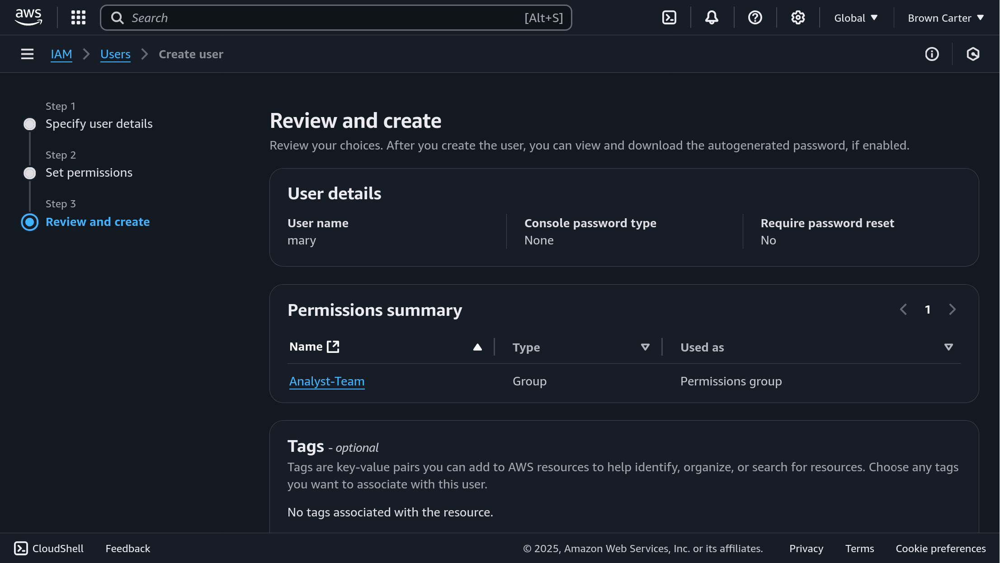

1. Explain the Role of IAM in AWS

Identity and Access Management (IAM) in Amazon Web Services is a critical service that allows administrators to manage who can access AWS resources, what actions they can perform, and which resources they can access. IAM provides granular control over permissions and helps enforce security policies across an AWS environment.

Key roles of IAM include:

    Authentication: Verifying the identity of users, groups, roles, or services trying to access AWS.

    Authorization: Controlling what authenticated identities can do by attaching policies that define allowed actions and resources.

    Security Management: Enforcing least privilege, multi-factor authentication (MFA), and role-based access control to minimize attack surfaces and prevent unauthorized access.

2. Differentiate Between IAM Users and Groups

    IAM Users: These are individual identities created to represent a single person or service. Each user has unique security credentials (username, password, access keys).

        Example: You create an IAM user for "John" so he can log in and work directly with AWS services using the AWS CLI or Console.

    IAM Groups: These are collections of IAM users that share the same set of permissions. Policies attached to a group apply to all its members.

        Example: You create a group called Backend_Developers with EC2 and S3 permissions and add John to that group.

Use Case Comparison:

    Create an IAM User when you need individual tracking or credentials (e.g., John or Mary).

    Use an IAM Group to efficiently manage permissions across multiple users with the same role.

3. Describe the Process of Creating IAM Policies

To create a custom IAM policy, follow these steps:

    Define Requirements: Identify what resources the user or group needs access to and what actions are allowed (e.g., read-only access to S3 buckets).

    Go to IAM Console → Policies → Create Policy.

    Select the JSON or Visual Editor: You can write custom JSON to define Action, Effect, and Resource.

    {
      "Version": "2012-10-17",
      "Statement": [
        {
          "Effect": "Allow",
          "Action": "s3:GetObject",
          "Resource": "arn:aws:s3:::marketpeak-analytics/*"
        }
      ]
    }

    Name the Policy: For example, DataAnalystReadOnlyPolicy.

    Attach the Policy: Link it to a specific IAM user (Mary) or group (e.g., Data_Analysts).

This allows tailored access control aligned with job responsibilities.
4. Explain the Significance of the Principle of Least Privilege

The Principle of Least Privilege (PoLP) means granting users only the permissions necessary to complete their tasks—no more, no less.

Why it's important in AWS:

    Reduces risk of accidental damage: A user with unnecessary permissions might accidentally delete resources.

    Limits blast radius of attacks: If credentials are compromised, an attacker has limited capabilities.

    Encourages good governance: Ensures access is intentional and auditable.

In practice, PoLP means creating fine-grained IAM policies that narrowly define access, continuously reviewed and updated as roles evolve.
5. Reflect on the Scenario with John and Mary

In the project setup:
John (Backend Developer)

    IAM User: john_backend

    Group: Backend_Developers

    Attached Policy:

        Full access to EC2 (to deploy and manage backend services)

        Limited access to S3 (to store backend config or logs)

    Example Policy Attached:

    {
      "Effect": "Allow",
      "Action": [
        "ec2:*",
        "s3:PutObject",
        "s3:GetObject"
      ],
      "Resource": "*"
    }

Mary (Data Analyst)

    IAM User: mary_analyst

    Group: Data_Analysts

    Attached Policy:

        Read-only access to a specific S3 bucket for analytics

        No EC2 access

    Example Policy Attached:

    {
      "Effect": "Allow",
      "Action": "s3:GetObject",
      "Resource": "arn:aws:s3:::marketpeak-analytics/*"
    }

Alignment with Principle of Least Privilege

    John has access only to services needed for backend tasks, such as EC2 and limited S3 usage.

    Mary can only view data in a specified S3 bucket, with no permissions to write, delete, or access other AWS services.

By assigning roles, grouping users, and applying custom policies, we ensured a secure, organized, and compliant AWS environment tailored to each team member’s responsibilities.
